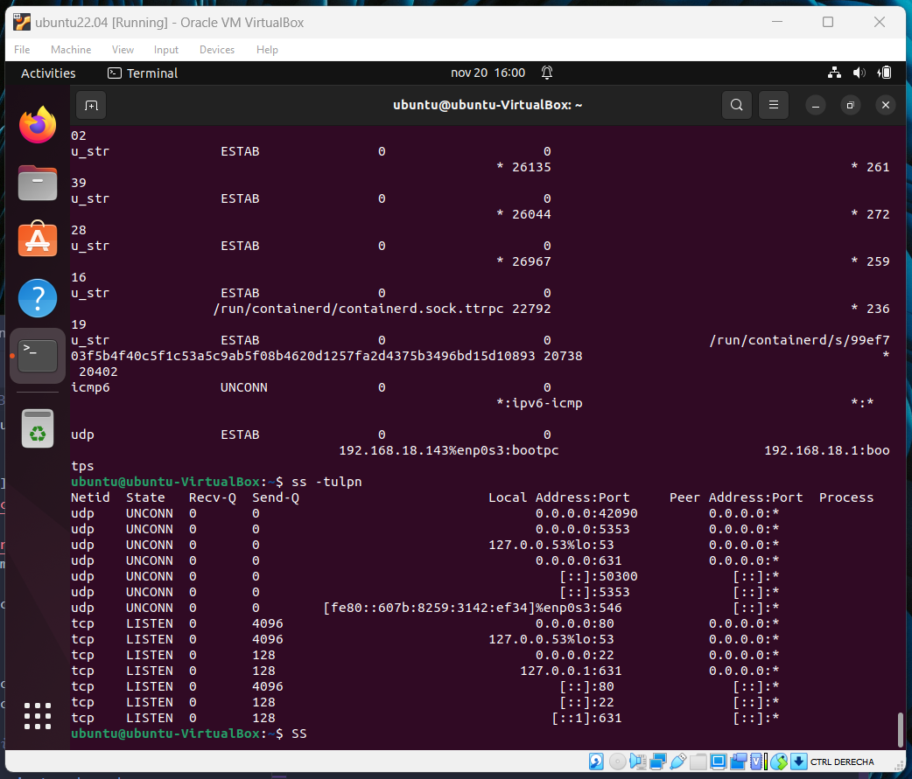

# PRÁCTICA 1

## Desarrollo de la práctica
Configuración de entorno y red

## Table of contents
[1. Configuración del entorno.](#config)
2. Instalar docker.
3. Reconocimiento de herramientas de red.
4. Identificar servicios desplegados.
5. Evaluar scripts en Python.
* [Setup](#setup)

## 1. Condiguración del entorno:
* Para esto se instalo ubuntu 22.04 en virtualbox 

## 2. Instalar docker:
* Se sigue la guía de [instalación de Docker en ubuntu](https://www.digitalocean.com/community/tutorials/how-to-install-and-use-docker-on-ubuntu-20-04-es), utilizando los siguientes comandos:
  * sudo apt update
  * apt-cache policy docker-ce  
    
    > Para instalar desde el repositorio de Docker

  * sudo apt install docker-ce
  * sudo systemctl status docker
    
    > Para comprobar el funcionamiento

## 3. Reconocimiento de herramientas de red

* [Comando ss:](https://www.ochobitshacenunbyte.com/2020/09/01/como-se-usa-el-comando-ss-en-linux/)
    > Listar todas las conexiones

  * ss -a, recupera una lista de puertos de escucha y no escucha.
  * ss -l, con el parámetro -l nos muestra únicamente los sockets que están escuchando
  * Con el parámetro -t podemos listar todas las conexiones TCP y con -u todas las conexiones UDP.

* Comando netstat:
El comando netstat genera visualizaciones que muestran el estado de la red y estadísticas de protocolo.
    > Para supervisar el estado de la red
    
    
    * netstat -s:  muestra estadísticas de los protocolos UDP, TCP, SCTP, ICMP e IP.
    * 
    
    * netstat -P transport-protocol: Entrega el estado de un determinado protocolo de transporte en un sistema. Los valores de la variable protocolo_transporte son tcp, sctp o udp.

* Comando [lsof](https://help.clouding.io/hc/es/articles/5797810889500-C%C3%B3mo-usar-el-comando-lsof-en-Linux#:~:text=lsof%20significa%20%22list%20open%20files,similar%20a%20netstat%20o%20ss.): significa "list open files" (en español "lista de archivos abiertos"). También se puede utilizar para listar conexiones de forma similar a netstat o ss.
  Este tiene unas columnas de salida, asi:
    > COMMAND PID USER FD TYPE DEVICE SIZE/OFF NODE NAME
    
  * lsof -u usuario : muestra los archivos abiertos por el usuario especificado.
  * lsof -c nombre_proceso : muestra los archivos abiertos por el proceso especificado.
  * lsof -i :numero_puerto : muestra los archivos abiertos por el puerto especificado.

## 4. Identificar servicios desplegados

Con el comando ss -l, se puede observar diferentes servicios. Estos son:
* ssh: 22
* http: 80
* rtnl:NetworkManager/650, es un servicio de red que se utiliza para gestionar los dispositivos de red y las conexiones.
* rtnl:xdg-desktop-por/2819, se relaciona con el escritorio de la computadora en el sistema ubuntu.
* Con el comando lsof, se puede observar un proceso: 2235183 /usr/lib/x86_64-linux-gnu/libjansson.so.4.13. Este se relaciona con una liberia de jansson, que es una librería de C para analizar JSON. Esta librería se utiliza para analizar los datos JSON de la API de Docker.